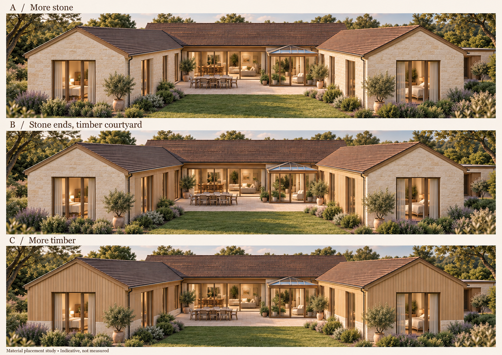
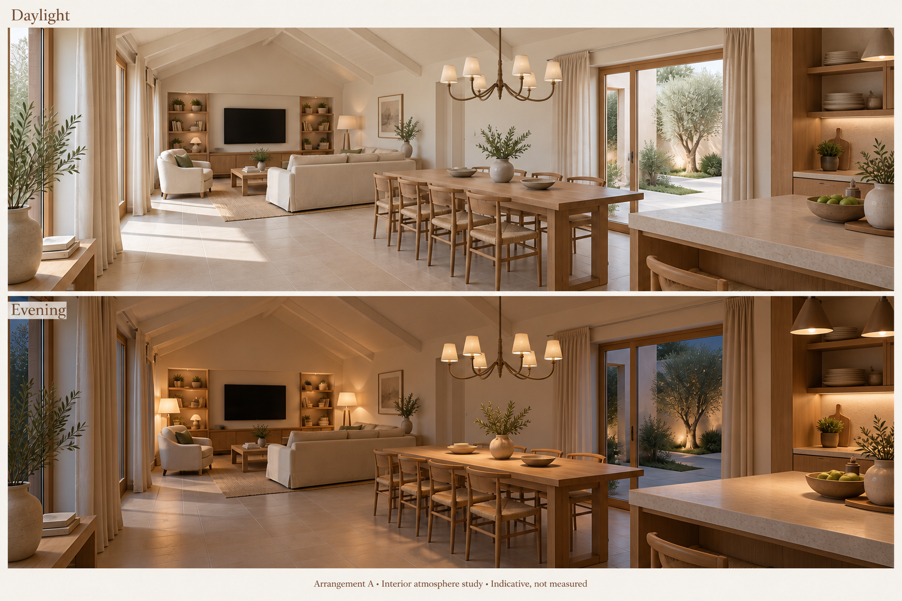

# Courtyard house: materials and character brief

11 September 2026 · Working design brief

## Direction

A warm, light, comfortable single-storey courtyard home, combining
Scandinavian and Japanese simplicity with French country texture and character.
Natural materials, generous garden-facing windows and places to gather around
the dining table, kitchen island and sofa are central to the brief.

The family is strongly anti-grey. Avoid grey and grey-leaning greige in paint,
stone, flooring, timber finishes and fabrics. Any exception needs a specific
reason. Natural timber should sit between pale and honey-toned, without a grey
wash or a strong orange cast.

This brief records the discussion's agreed direction, supporting proposals and
open decisions. It is not a product specification or construction document.
The written decisions below take precedence over incidental details in the
illustrations.

## Agreed architecture and arrangement

- **Baseline:** the single-storey U-shaped house, with concept 07 opening the
  garden room and relocating the hall door within the concept 05 footprint.
  The separate two-storey option remains an alternative.
- **Roof form:** concept 06B is the chosen direction: a continuous pitched roof
  over the shared family area, with lower, near-flat roofs on the stone wings
  and gym. This supersedes the earlier pitched-wing preference. The study's
  detailed heights remain provisional; roof pitch, covering, structure, eaves
  and junctions remain to be designed.
- **Exterior character:** primarily stone projecting wings meeting timber on
  the main family area. Both the more-stone and mixed studies appealed; the
  distinct character of the wings is more important than an exact material ratio.
- **Shared room:** retain arrangement A, with the TV/media wall at the living
  end, sofa facing it, dining in the centre and kitchen island beyond.
- **Courtyard relationship:** the main sofa sits behind the family wing and
  receives light through outer-facing windows. The strongest courtyard
  connection is at dining and the orangery. Central-lounge alternatives and
  wider courtyard glazing were considered but not selected.
- **Garden room:** year-round use, open to the shared room and adjoining hall.
  Remove the two internal orangery walls and their separating doors, retaining
  the exterior glazing. Treat it as a garden-facing sitting area within the
  shared interior. An extensively glazed roof is now a firm preference, with
  year-round comfort designed around it. The selected transition is a shallow
  glazed roof falling toward the courtyard, seen through a broad opening with
  a plain ivory head. Continue the same floor and warm finishes through.
  Glass should combine insulation and solar control, with neutral-looking samples;
  provide for retractable external roof shading and investigate motorised
  high-level vents with rain control. Heating/cooling should follow winter
  heat-loss and summer-overheating assessments for the whole connected space.
  These are agreed design requirements, not a completed performance specification.
- **Guest/office separation:** relocate the former orangery hall door across the
  hall beyond the snug, when walking from shared living. The snug, visitor WC
  and garden sitting area stay on the shared side; office and guest rooms sit
  beyond the new door. Concept 07 tests a 900 mm hinged door opening toward the
  office, while retaining the office's own door.
- **Ceiling:** one continuous shared-room vault is the preferred direction,
  connecting lounge, dining and kitchen. Retain warm ivory pitched roof slopes,
  with any exposed timber painted to blend in. Natural wood is concentrated in
  furniture, frames and joinery. Finished heights and structural members are open.

Concept 07 records the measured opening and hall-door revision. The original
concept 05 remains available. Geometry checks do not validate structure, roof
junctions, thermal performance, materials or the stove.

## Roof development: concept 06B

`output/pdf/concept-06b-continuous-vault-low-wings.pdf` illustrates the chosen
continuous shared-room vault with lower stone wings and gym. It retains concept 05's room
layout, including pantry and service rooms with flat ceilings beneath the same
main roof. The earlier all-pitched study remains available for comparison.

The main roof edge at +3.70 m, ridge at +5.32 m, lower roof envelopes at +3.20 m,
and shared ceiling rising from 3.50 m to 4.91 m are study assumptions, not agreed
heights. Low-roof falls, edge profiles and abutments require design. The orangery
is reserved as a low volume. Its year-round use and open connection are now
chosen. Concept 07B develops the selected shallow glazed-roof transition; its
structural and weatherproof details remain to be designed. Concepts 07/07B
supersede the older roof PDF notes about undecided use and separating walls.

## Glazed-roof transition: concept 07B

`output/pdf/concept-07b-glazed-roof-transition.pdf` shows a 1:50 section and a
geometry-based interior perspective. It tests glass roof surface heights of
+2.85 m at the courtyard and +3.45 m at the house, a slope of about 9.7 degrees.
The main opening tests a 3.10 m clear head with a 0.40 m ivory band beneath the
3.50 m shared-room ceiling edge. These new dimensions are provisional and
replace the earlier garden-roof box only for this study. The hall-side ceiling
is lower, consistent with the wing ceiling direction.

The full open corner is still design intent; no post-free structural scheme has
been demonstrated. Framing, glass system, roof pitch, gutters/flashings, shading
hardware, ventilation and thermal performance require coordination. No glazing
product, supplier or heating/cooling capacity has been selected.

## Shared-space development: concept 08 (proposal for review)

`output/pdf/concept-08-shared-space.pdf` brings the agreed palette into a
1:50 furnished shared-space plan and two interior views. The proposal retains
arrangement A, shortens the media unit for a stove reservation, moves one
armchair and refines the garden sofa/chair group. It tests a 2.80 m island with
three stools on the garden side, an island hob, a rear sink/dishwasher run and
separate oven and fridge towers. None of these new equipment or furniture
choices is an approved product specification.

The dining revision selected on 12 September rotates the table 90 degrees and
lengthens it to 3.00 x 1.00 m, with four chairs on each long side and no end
chairs. The centre and chandelier position stay fixed. This gives 0.75 m per
place, 1.05/0.85 m clear at the ends, and 1.55 m toward the island (1.20 m with
chairs pulled out 0.35 m). All 13 nominated routes pass in both chair positions.
Table legs, exact chair sizes and final furniture products remain to be selected.
The kitchen aisle remains 1.45 m, reducing to 0.85 m with an assumed 0.60 m
appliance door open. Extraction and cabinet details remain to be coordinated.

The 1.35 x 1.50 m hearth zone and stove shown are placeholders. Appliance
clearances, wall/TV heat protection, air supply, flue assembly and roof
penetration require checking with the selected system and installer. The
study now locates these elements but does not establish installation fit.

## Courtyard and facade development: concept 09

`output/pdf/concept-09-courtyard-elevations.pdf` coordinates the exterior with
the current shared-space layout. The courtyard layout was selected on
12 September: an eight-place outdoor dining
terrace in the wider court, a separate sofa/chair pad nearer the garden, and
planting along the family wing. The narrow strip beside the garden room stays
open for circulation between the house, the two sliders and the main garden.

The palette carries warm buff paving, textured stone wings, vertical timber
on the shared-room facade and warm bronze frames/edges. Exact products remain
open, including a timber finish and maintenance approach that retain warmth
rather than defaulting to a grey weathered appearance. Roof colour and edge
profiles are placeholders. Garden and return elevations retain opening widths
and show the chosen roof direction; junctions remain technically unresolved.

This layout uses 50.78 m2 of paving in the 88.40 m2 courtyard, leaving 37.62 m2
for soft landscape and wall-side strips. That is more paving than the earlier
rough terrace. The planting band and its 0.90-1.20 m maintained-height proposal
need testing against bedroom privacy, window sills, daylight and actual species.
Concept 11 now assumes a south-facing courtyard in Northumberland. Sun/shade
performance, wind shelter and drainage remain unresolved. Exact materials,
planting and new facade details remain proposals.

## Lighting development: concept 10 (direction supported)

`output/pdf/concept-10-lighting-scenes.pdf` develops the warm layered-light
direction into positions, controls and an illustrative evening view. Retain the
dining chandelier as the feature, with separate kitchen task spots, concealed
ambient runs, shaded lounge lamps and a garden-room wall reading light on a
solid pier. Proposed indoor colour temperature is 2700 K. Coordinate the ambient
ledges and driver access with the continuous vault; keep fittings off roof glass.
The revised proposal extends ambient light along the pantry face and the hall
to the WC with three concealed wall runs. This separate group remains on in
all three shared-room scenes, including when kitchen task lighting is off.
Pantry shelf and WC mirror lights have independent local switches.

The user supports the revised interior ambient direction. Outside, retain the
four spaced bronze pillars replacing the outdoor table lamps.
Propose 0.75 m height, 0.18 m square bases and recessed downward
light at 2200-2700 K, alongside the two retained low threshold lights. Their
positions preserve the checked routes and furniture clearances; actual light
coverage remains unverified. Add seven broad downward wall lights matching the
user's numbered courtyard markup: four on solid family-side wall sections and
three on the guest return, provisionally 2.00 m high. A separate ambient dimmer
allows overlapping pools across paving and seating to supplement the pillars.
Use the same warm bronze / warm-light direction. Actual overlap, window spill
and planting shadows require checking; no dedicated planting uplights are proposed.
Wall buttons recall Everyday, Entertaining and Quiet evening, with
local reading controls and separate pillar / wall-light dimming. Outdoor light operates
after dark while in use, with a proposed extendable 60-minute auto-off.

Eight scene groups, local task lights and one indoor portable describe the use;
scene percentages are commissioning starting values. Actual fittings, output,
beam angles, glare, glass reflections, spill, mounting, electrical design and
dimming compatibility remain unresolved. The view is a mood illustration.

## Agreed shared-space palette

| Element | Agreed direction | Still to specify |
| --- | --- | --- |
| Perimeter kitchen cabinets | Warm ivory paint; slim, simply framed doors; matte finish | Exact paint, door profile and cabinet layout |
| Kitchen island | Rich, dark forest green with a definite green character; same restrained door detailing | Exact green, sheen sample and hardware |
| Worktops | Warm cream or buff with quiet variation; honed appearance; simple edge | Actual material, thickness and edge dimensions |
| Natural timber | Pale-to-honey oak direction for dining furniture, media storage and selected details | Species/product, grain, finish and placement |
| Metal details | Muted warm bronze, relating to the dining light | Exact finish and fittings |
| Main sofa | Slightly deeper oatmeal; warm and comfortable | Fabric, durability, construction and final dimensions |
| Floor appearance | Warm hard flooring, softened by a generous rug around the sofa group | Stone versus porcelain; exact surface, format and grout |
| Dining light | One chandelier-style feature over the table, replacing the two pendants | Shape, scale, suspension and product |
| General lighting | Warm, layered evening light from lamps, accessory and discreet integrated lighting; useful cooking and reading light | Positions, circuits, controls and fittings |

The six-arm bronze chandelier with ivory shades is an accepted starting point.
Its detailed shape can be refined without further image generations solely for
that purpose. The forest-green island supersedes the earlier oak-island idea;
forest green was chosen over olive or moss.

## Supporting proposals, not yet fixed

- Warm cream/buff/sandy stone with natural texture outside, alongside timber
  at the shared family area and selected sheltered details.
- A matte floor with gentle variation, subtle edges and warm, closely matched
  grout; avoid strong veining or a heavily distressed appearance.
- Lighter cream armchairs, natural linen curtains and a textured cream/oatmeal
  rug alongside the deeper oatmeal sofa.
- Small forest-green, tobacco or muted-rust textile accents.

These are consistent proposals to test with samples. They should not be treated
as independently approved finishes for every room.

## Decisions to keep open

| Decision | Current position | Next check |
| --- | --- | --- |
| Shared-room flooring | Real limestone remains appealing; easier care matters. Limestone-effect porcelain throughout, with real stone at the hearth and selected details, is a worthwhile combination to explore, not a final selection. | Compare physical stone and porcelain samples beside the oak, ivory and forest green; discuss care and acceptable ageing. |
| Worktop material | Appearance and edge direction are agreed; no material or product has been selected. | Compare samples for appearance, texture and practical use. |
| Exterior materials | Stone wings and a timber family area are the working direction. Exact distribution, stone, timber and roofing remain open. | Resolve elevations and junctions; compare actual samples and expected weathering, particularly any greying of timber. |
| Log burner | A modern log burner is wanted within the existing lounge arrangement. Fit has not been demonstrated. | Coordinate appliance, hearth, heat output, clearances, air supply, flue and roof structure. |
| Other rooms | Concept 12 proposes arrival / utility joinery; concept 13 develops the snug for TV, films and reading. | Parents-suite A is selected; concept 15 proposes children, family bath and linen. |

For the stove, the preliminary location to investigate is the family-wing end
of the existing TV/media wall, beside the television. The discussion suggested
shortening shelving, repositioning one armchair and drawing the rug back from
a warm stone hearth. Concept 08 now draws this as a measured spatial reservation. It has not been
checked for appliance clearances. Retain the current room arrangement while
testing it; do not assume the ordinary floor finish alone provides the required
hearth construction.

The courtyard now faces south for a working location in Northumberland. Exact
plot, exposure, budget and final roof design remain unresolved. The garden
room is now intended for year-round use as part of the shared interior.

## Year-round comfort development: concept 11 (proposal)

`output/pdf/concept-11-year-round-comfort.pdf` develops the comfort brief around
the Northumberland / south-facing assumption. The drawing stays in its existing
orientation: south at top, north at bottom, east left and west right. Family-wing
courtyard windows face west; the garden-room side window faces east.

Propose external roof shading and vertical screens, high-level roof vents and
usable north/south purge openings. A roof-shade reservation stops before a high
vent strip, leaving approximately 0.95 m of upper glazing unshaded; assess this
with the selected glass and actual system. Frames, cassette, vent sweep, low-pitch
weathering and access remain unresolved. Closed-door night ventilation requires
a designed secure inlet; the current door openings alone do not establish it.

Develop wet underfloor heating with a heat-pump design and coordinated controls
for the open shared / garden space. Study whole-house MVHR for everyday fresh
air separately from summer purge ventilation. Heating capacity, usable floor
area, plant, manifolds and duct routing require design. Retain the stove as a
separate local heat source with output checked against the room demand.

The plan, section and seasonal diagrams are a design brief. Site-specific
thermal modelling, bedroom overheating assessment and room heat-loss work
must test it before glazing, ventilation or heating specifications are fixed.

## Arrival, storage and utility: concept 12 (proposal)

`output/pdf/concept-12-arrival-storage-utility.pdf` adds a furnished plan and
storage elevations, retaining room polygons and adding the approved direct
kitchen–utility hinged door D19. Allow a 0.80 m opening with the hinge at its
north end, opening back into the utility; retain boot-room access. Specify final
frame / clear passage and coordinate the door head with ambient lighting.
Investigate a solid-core doorset, perimeter seals and a suitable bottom seal,
with ventilation transfer designed around that sealing. No acoustic rating
is established. Use warm-ivory closed
storage, a honey-oak bench and shelves, muted bronze hardware and the continuous
warm hard floor. Products, finishes and joinery construction remain open.

The boot room has a proposed 1.85 m bench with three shoe bays and five hooks,
plus 1.10 m of closed coats / bag storage. Wet coats stay on open hooks. The
entrance has a 0.90 m visitor-coat cupboard and a shallow keys ledge / mirror.
Sliding cupboard fronts are proposed, with usable hanger depth to check.

The user confirmed a separate washer and dryer plus some air-drying space.
The utility proposal reserves two 0.65 m machine bays in a 0.75 m-deep run,
with a sink and sorting storage. The return combines a 0.70 m ventilated hanging
cupboard with 1.45 m of folding counter. Cupboard airflow, moisture handling and
drying capacity require design. The 1.03 m return aisle is a one-person work area.

The pantry keeps storage on its two end walls: a 0.60 m counter with shelves
above and opposite 0.40 m food shelves, leaving 1.60 m between fronts. Both
pocket-door cavities remain reserved. Cabinet divisions and shelf heights are
proposals; check countertop appliances, hardware and electrical access before
manufacture. The layout is awaiting review; the laundry preference is confirmed.

## Snug: concept 13 (proposal)

The confirmed use is **TV and films, with room to read**, superseding the earlier
reading / play emphasis. Retain the enclosed 4.58 x 2.60 m room and its window.
`output/pdf/concept-13-snug.pdf` proposes a 2.30 m sofa facing a low-mounted
55-inch TV allowance, surrounded by shallow honey-oak / warm-ivory storage.
The screen size is provisional; coordinate actual eye height, mount and cables.
Use closed storage below, books at either side, a movable upholstered footstool
and a small side table. Keep the window approach open and use a recess blind
for film viewing, subject to window hardware and blind selection.

Propose an olive / moss sofa, fitted wool-rich carpet and bronze reading lights.
These extend the palette but are not selected products or approved finishes.
Separate low ambient light for films, local reading lights and general light
for everyday use. Check screen reflections and actual output; no lighting or
acoustic calculation is claimed. The room geometry and door stay unchanged.

## Parents' suite: concept 14 (proposal)

The user confirmed a **super king (180 x 200 cm)**. **Two basins and a generous
separate shower take priority over an ensuite bath**. Both options in
`output/pdf/concept-14-parents-suite.pdf` retain these requirements. Option A
is recommended because it preserves the dressing room and larger shower;
Option B adds a bath by moving the partition 0.70 m and reducing clothes storage.
Option A is selected; the user declined the bath compromise. The comparison
PDF remains available as a decision reference.

Turn the bed onto the solid north wall. Propose a linen upholstered headboard,
warm ivory walls, honey-oak bedside units, bronze reading lights and wool-rich
carpet. Each side gets independent reading / dimming controls, with a separate
low-level route to the ensuite and blackout at both windows. Coordinate the
head wall with the family bathroom behind it; no acoustic rating is established.

Carry warm ivory / buff porcelain, honey oak and bronze into the ensuite.
The 1.20 m double vanity is compact and needs basin / tap / drawer selection.
Keep mirror lighting separate from night lighting. Resolve the wet-zone window,
privacy, waterproofing, drainage, ventilation, suitable surfaces and bathroom
electrics before fixing finishes. The illustrations are spatial proposals.

## Children, family bathroom and linen: concept 15 (proposal)

The user confirmed small doubles where they fit and a family bathroom with
bath, separate generous shower and two basins. The three equal child rooms
receive matching bed / desk / wardrobe allowances, mirrored to suit their
windows and doors. Use warm ivory and honey oak as a shared base, with each
child choosing an accent colour. Propose a soft bedroom floor, individual
reading and task lights, separate general light and blackout; select age-suited
desks / chairs and check window operation and furniture fixings.

The family bathroom has a 1.70 x 0.75 m bath, 1.20 x 1.20 m shower, 1.40 m
double vanity and WC. D03 moves 0.25 m north to clear the vanity. Room and window
sizes stay unchanged. Warm buff / ivory porcelain, oak vanity fronts and bronze
fittings remain proposals. Coordinate the shower window, wetroom construction,
plumbing at the parents' bed wall, ventilation, mirror lighting and night light.

Retain the linen cupboard's existing plant placeholder until services are sized.
Only a 0.90 m-wide x 0.45 m-deep, five-level linen unit is proposed. Its capacity
is modest; equipment and maintenance space may reduce it further. Do not order
joinery or relocate equipment based on this footprint exercise.

## Services requirements confirmed, 12 September

Regular household: two adults and three children. Visiting family may include
grandparents, aunt, uncle and cousins. The user estimates four or five guests;
use five as the upper planning allowance (ten people total). Provide for two high-flow rain showers running comfortably together.
Actual shower flow rates, supply performance, cylinder storage and recovery
remain to be designed; the earlier 300-litre reference is not a selected size.

Active cooling is mandatory and intended to be powered by solar PV. This
supersedes treating active cooling as merely an option after overheating
assessment. Include all bedrooms, shared / garden room, office, snug and gym.
Calculate loads and coordinate quiet room delivery with ceilings and interiors. Retain shading and ventilation measures.
Model solar generation and cooling demand, including evenings / nights; battery
and grid contributions are open decisions, not an assumed solar-only guarantee.

## Plant location and linen: revised direction, 12 September

The family-wing annexe from concept 16 is declined. The user wants plant at the
laundry / gym end, away from bedrooms. Investigate rearranging the laundry and/or
extending the gym block while retaining the full usable gym. Prefer a continuous
extension of that block to another separate annexe; its roof, structure and
rainwater drainage still need design. No extension size or plant layout is chosen.

Preserve the separate washer and dryer, some useful air-drying space and direct
kitchen-utility access. Side-by-side machines are preferred; stacking is a fallback the user would
consider. Changing the joinery is not yet an agreed layout. Check noise transmission toward the snug,
service access and hot-water / ventilation routes across the house.

`SERVICES-BRIEF.md` records requirements and outstanding inputs. Concept 16's
2 m linen run remains conditional on a successful plant relocation; retain the
existing plant reservation meanwhile. Its PDF is a historical rejected option.

## Visual references

These generated studies explore appearance. They are not measured elevations,
lighting calculations or verified construction details.

### Exterior: stone and timber placement

The preferred direction draws on **A and B**, with the wings having their own
stone character and the family area expressed in timber. C was not selected.
Wing proportions, openings, roof surfaces and landscaping are illustrative.

### Interior: daylight, evening and chandelier

The atmosphere and chandelier direction were welcomed. **This image predates
the forest-green island, ivory painted perimeter cabinets, slim framed doors
and deeper oatmeal sofa decisions.** Its timber kitchen, upholstery and other
incidental details are not the current specification. The stove is absent.
Furniture proportions, windows and joinery need reconciliation with the
measured plan before design development.

## Next steps

1. Assemble a small physical sample set: two floor candidates, ivory and forest
   green paint, oak, a worktop candidate, bronze and oatmeal upholstery. Compare
   them together in daylight and warm evening light before selecting products.
2. Review the concept 08 stove reservation, then coordinate a selected appliance,
   hearth and flue with furniture, TV and roof structure.
3. Carry the palette into the entrance, snug and bedrooms, recording each new
   choice separately from proposals.

## Project and practical references

- [Measured concept 05](output/pdf/u-home-dimensioned-concept.pdf)
- [Room brief, measurements and verification limits](README.md)
- [Earlier design handoff](HANDOFF.md)
- [HETAS installation guidance](https://www.hetas.co.uk/consumer/services/installers/):
  appliance and building-specific installation requirements.
- [Natural limestone care](https://www.mandarinstone.com/inspiration/how-to-seal-and-clean-a-limestone-floor/)
  and [stone-effect tile guidance](https://www.mandarinstone.com/help-support/style-effects-faqs/):
  references used in the flooring discussion, not selected suppliers or products.
