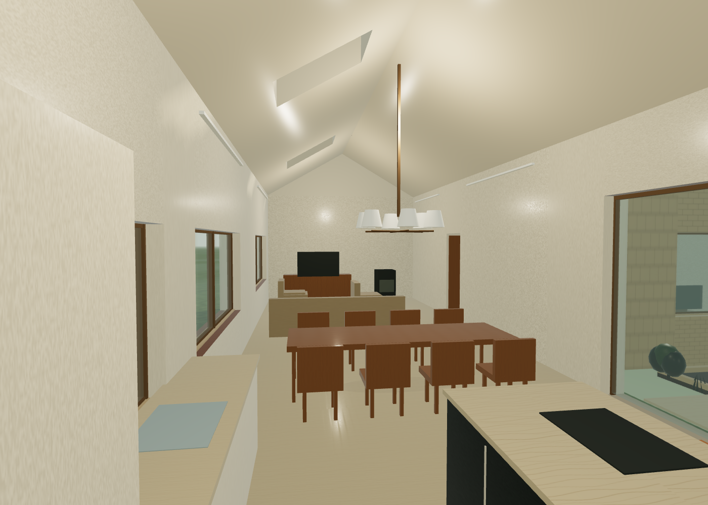
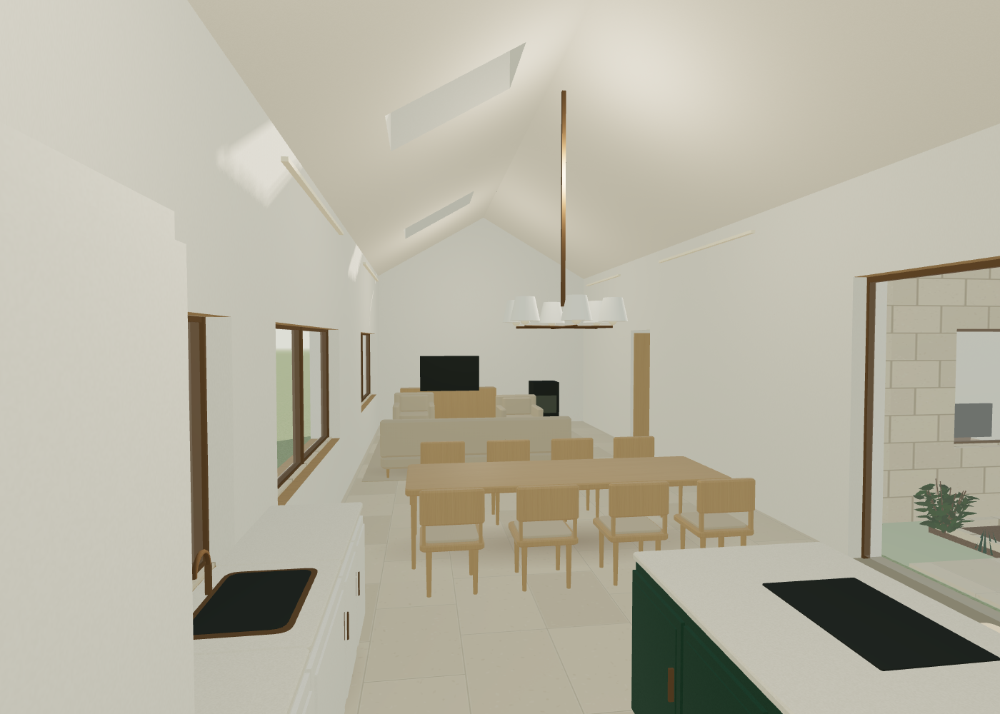
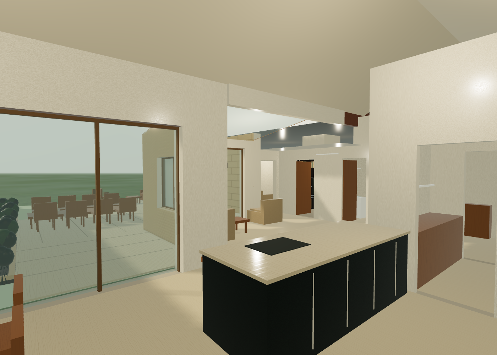
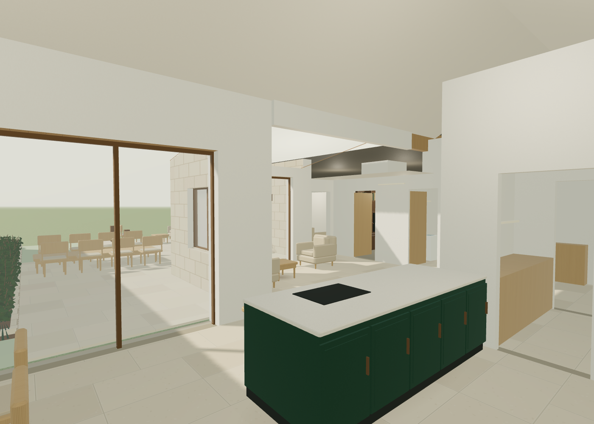
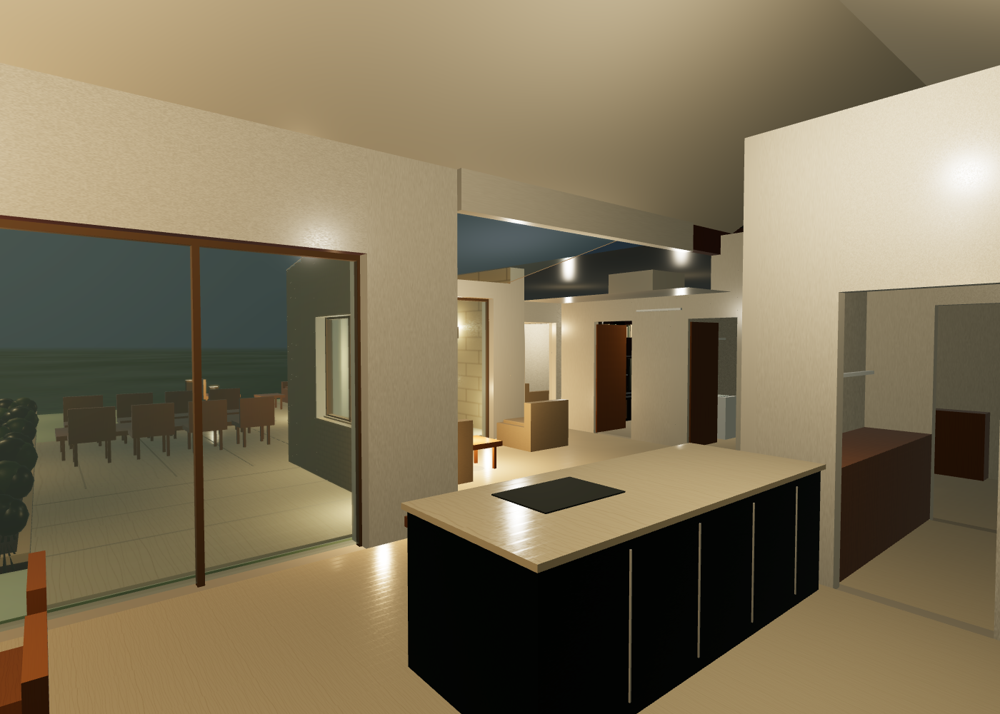
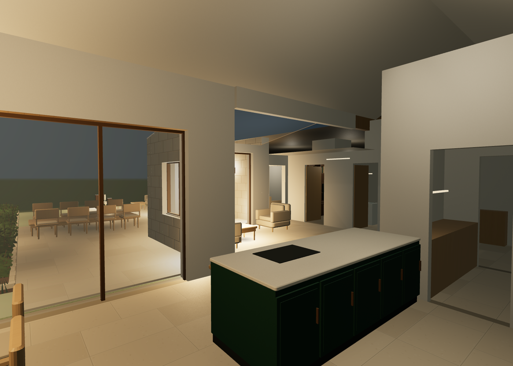
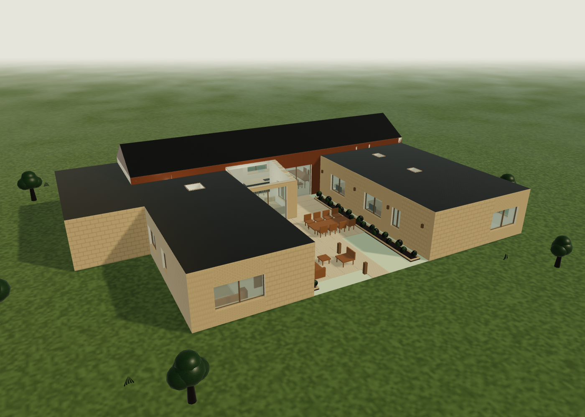
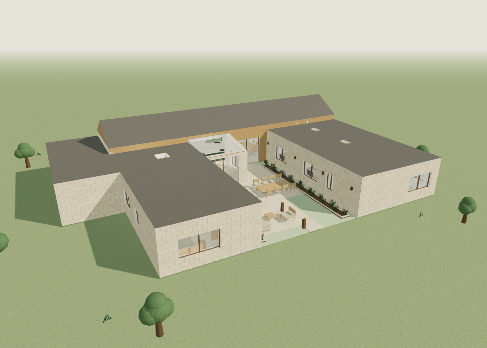

# Shared-space fidelity review

6 October 2026. Baseline: `2410ba6` (Design book 02 on main).

The kitchen, dining area, garden room and courtyard are the first review area.
The measured model is unchanged: 26 rooms, 332.96 m2 internal envelope and
373.31 m2 footprint. Roof forms and heights remain the recorded study assumptions.

## Changes

- Map stone, timber, floors and roof faces in metres. Stone courses now continue
  across wall pieces. Colour, roughness and normal maps use consistent scales;
  colour maps supply the surface colour without a second palette tint.
- Use a warm stone floor, a separate honed worktop, slim framed ivory/green
  cabinet fronts, softened tables, shaped chair backs, tapered legs and separate
  seat cushions. Add the brief's lounge rug within the shared-space allowance.
- Replace solid courtyard shrubs with instanced leaves and stems. Combine static
  wall faces by material to offset the cost of added detail.
- Use sharper sun shadows, softer contact shadows, a quieter interior fill and
  warm luminous lamp surfaces. Roof faces point outward to prevent self-shadow
  patterns. Thin glass uses specular reflections and alpha
  transparency to keep overlapping panes clear. It is a browser approximation;
  it does not simulate refraction through an insulating glass unit.

Finish patterns, furniture details and plants are illustrative. Floor joints
show a nominal 0.90 x 0.60 m pattern; this is not a selected tile product. The
5 October layout additions remain a separate design study.

## Matching views

Both versions use the same camera, 1400 x 1000 viewport and device scale 1.

| View | Before | After |
| --- | --- | --- |
| Shared room |  |  |
| Dining daylight |  |  |
| Dining evening |  |  |
| Courtyard daylight |  |  |

## Rendering measurements

Chrome headless, ANGLE Metal, Apple M1 Max; device scale 1. Desktop is
1400 x 1000. Mobile is a 390 x 844 viewport on the same Mac GPU, not a phone test.
Each result uses 12 forced renders after the view settles. `gl.finish()` waits
for the GPU before recording a duration. These are frame costs, not continuous
walking FPS or loading times. The p95 is the slowest of the 12 samples.

| Viewport | View | Median ms before / after | p95 ms before / after | Draw calls before / after |
| --- | --- | --- | --- | --- |
| Desktop | Shared room daylight | 3.6 / 1.7 | 4.7 / 1.9 | 1190 / 479 |
| Desktop | Dining daylight | 6.0 / 2.5 | 6.6 / 4.9 | 3015 / 990 |
| Desktop | Dining evening | 60.7 / 3.2 | 121.2 / 4.6 | 3015 / 990 |
| Desktop | Courtyard daylight | 8.2 / 3.9 | 12.3 / 6.2 | 4260 / 1492 |
| Mobile | Shared room daylight | 2.6 / 1.8 | 3.0 / 2.3 | 621 / 292 |
| Mobile | Dining daylight | 5.0 / 2.2 | 6.6 / 3.5 | 1640 / 458 |
| Mobile | Dining evening | 4.1 / 3.3 | 4.4 / 3.6 | 1640 / 458 |
| Mobile | Courtyard daylight | 8.4 / 3.9 | 12.4 / 5.8 | 4151 / 1456 |

All measured views completed without a WebGL error or context loss. Daylight
frame costs are roughly halved. The old desktop evening view's large cost is
removed by avoiding the screen-space transmission pass. GPU, resolution and
scene coverage affect the result; these measurements do not establish phone
performance. Shadow-map rebuilds and first shader compilation are outside this
warm-frame comparison.

Raw data: [before](../output/design/fidelity-review/before-measurements.json)
and [after](../output/design/fidelity-review/after-measurements.json).

## Verification

The model exporter produces identical `model.json`. The measured checks retain
all 168 routes, clear door centres, roof coverage and the three office states.
Browser checks cover usable texture coordinates, stone scale across wall pieces,
outward roof normals, rooflight openings, courtyard chair direction, local-only loading, book download,
view controls, office states, day/evening, walking, door interaction, wall collision
and mobile overflow. The book views and PDF are regenerated from the updated scene.

To repeat the current captures and measurements with the preview server running:

```sh
node scripts/measure_viewer.cjs current
```

Results go to `tmp/fidelity/current/`. `BASE_URL` and `CHROME_PATH` follow the
browser check's conventions. The benchmark records the actual WebGL backend;
compare runs on the same backend and resolution.
